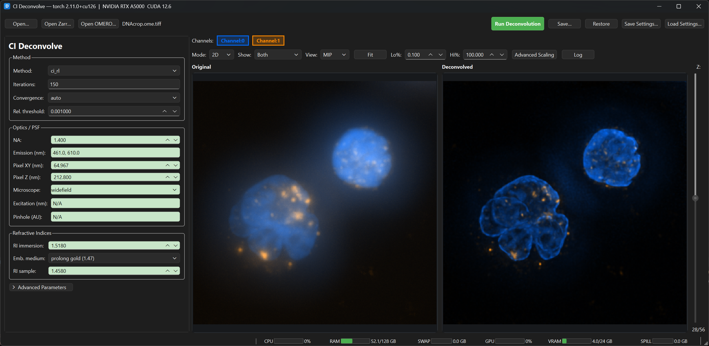
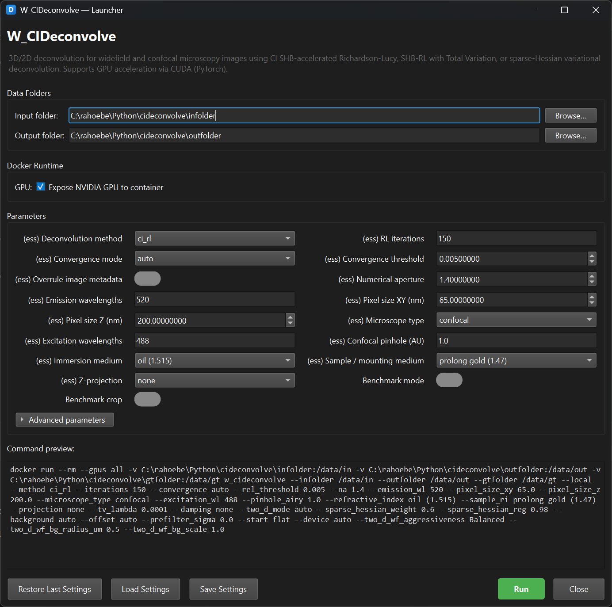

# CIDeconvolve

**GPU-accelerated 3-D / 2-D fluorescence microscopy deconvolution — SHB Richardson-Lucy, TV regularisation, and sparse-Hessian variational solver, all via PyTorch.**

| | |
|---|---|
| **Docker image** | `cellularimagingcf/w_cideconvolve` |
| **Version** | v1.5.0 |
| **Container type** | Singularity (pulled from Docker Hub) |
| **Methods** | `ci_rl` · `ci_rl_tv` · `ci_sparse_hessian` |
| **Benchmark** | built-in with timing metrics CSV and MIP montages |

---

## Overview

CIDeconvolve is a [BIAFLOWS](https://biaflows.neubias.org/)-compatible workflow that deconvolves widefield and confocal fluorescence microscopy images.  It reads OME-TIFF / OME-Zarr metadata where available, auto-generates a physically accurate PSF from the optical parameters, and applies one of three native GPU-capable deconvolution methods.

**Three user-facing entry points:**

| Entry point | Purpose |
|---|---|
| `gui_deconvolve_ci.py` | Full standalone interactive GUI — open files, configure parameters, run deconvolution, inspect results side-by-side |
| `launcher.py` | Docker launcher GUI — builds and runs a `docker run` command from a parameter form |
| `wrapper.py` | BIAFLOWS / BIOMERO CLI entrypoint for batch and HPC use |

---

## Deconvolution Methods

### `ci_rl` — Scaled Heavy Ball Accelerated Richardson-Lucy

Standard Richardson-Lucy enhanced with **Scaled Heavy Ball (SHB) momentum acceleration** (Wang & Miller 2014).  Achieves 5–10× faster convergence than vanilla RL at no extra per-iteration cost.  Includes Bertero boundary-correction weights and I-divergence convergence monitoring.

**Best for:** Fast, stable deconvolution of most microscopy images.

### `ci_rl_tv` — SHB-RL with Total Variation Regularisation

Same SHB-RL engine with an additional **Total Variation (TV) penalty** after each update (Dey et al. 2006).  Suppresses noise amplification at high iteration counts while preserving edges.  Controlled by `--tv_lambda` (typical range 0.00005–0.001).

**Best for:** Noisy data where edge preservation is important; higher iteration counts.

### `ci_sparse_hessian` — Sparse-Hessian Variational Deconvolution

A quality-focused **sparse-Hessian / SPITFIRE-style** variational method.  Combines the same FFT-based forward model and preprocessing stack with a sparse-Hessian prior that favours thin, high-contrast structures while suppressing noise.  Controlled by `--sparse_hessian_weight` (0–1) and `--sparse_hessian_reg` (0–1).

**Best for:** Filaments, membranes, and synapses; sparse structures that need to stand out against diffuse background.

### Stabilisation and PSF options

- **Noise-gated damping** (`--damping`) — per-voxel correction attenuation in low-signal regions
- **Positive offsetting** (`--offset`) — pre-shift before iteration to prevent division by zero
- **Anscombe prefiltering** (`--prefilter_sigma`) — variance-stabilised Gaussian smoothing before deconvolution
- **Initial estimate** (`--start auto|flat|percentile_flat|observed|observed_bgsub|lowpass|lowpass_bgsub|hybrid`)
- **Auto early stopping** (`--convergence auto`) — halts when relative I-divergence change < `--rel_threshold`
- **Enhanced 2D widefield mode** (`--two_d_mode auto`) — collapses a full 3D Gibson-Lanni PSF to 2D for single-plane widefield data with aggressiveness and background controls
- **Physically accurate PSF** — vectorial Richards-Wolf model (NA ≥ 0.9) or scalar Kirchhoff (NA < 0.9), Gibson-Lanni OPD aberration correction, sub-pixel integration, finite confocal pinhole convolution
- **Automatic memory tiling** — tiles large volumes with feathered overlap to fit GPU or CPU RAM

For full algorithmic details see [DECONVOLVE_CI.MD](DECONVOLVE_CI.MD).

---

## GUI — Interactive Deconvolution (`gui_deconvolve_ci.py`)



The standalone interactive GUI is the primary tool for exploratory deconvolution.  It provides a full parameter panel on the left and a synchronized dual-pane image viewer on the right.

### Running the GUI

```bash
python gui_deconvolve_ci.py
```

The title bar shows the detected PyTorch version and GPU (e.g. `CI Deconvolve — torch 2.4.1 | NVIDIA RTX 4090 CUDA 12.6`).

### Image loading

| Button | Supported formats |
|---|---|
| **Open…** | OME-TIFF, ND2, CZI, LIF, and any format supported by BioIO |
| **Open Zarr…** | OME-Zarr (local, HCS plates) |
| **Open OMERO…** | OMERO server — browse projects/datasets/images (requires `omero-browser-qt[viewer]`) |

Image metadata (NA, pixel sizes, wavelengths, acquisition mode, confocal pinhole) is extracted automatically from OME fields, MapAnnotations, and SVI/Huygens XML annotations.

### Deconvolution controls (left panel)

#### Method
| Control | Default | Options |
|---|---|---|
| Method | `ci_rl` | `ci_rl`, `ci_rl_tv`, `ci_sparse_hessian` |
| Iterations | `50` | comma-separated per-channel |
| Convergence | `auto` | `auto`, `fixed` |
| Rel. threshold | `0.001` | 1×10⁻⁸ – 1.0 |

#### Optics / PSF
| Control | Default | Notes |
|---|---|---|
| NA | `1.4` | 0.1 – 2.0 |
| Emission (nm) | `520` | comma-separated per channel |
| Excitation (nm) | `488` | comma-separated per channel (confocal only) |
| Pixel XY (nm) | `65.0` | lateral pixel size |
| Pixel Z (nm) | `200.0` | axial step size |
| Microscope | `confocal` | `widefield`, `confocal` |
| Pinhole (AU) | `1.0` | Airy disk units per channel; `0` = legacy point-detector; hidden for widefield |

#### Refractive indices
| Control | Default | Options |
|---|---|---|
| RI immersion | `1.515` | air, water, oil and more |
| Embedding medium | `prolong gold (1.47)` | 8 standard presets |
| RI sample | `1.47` | editable spin box |

#### Advanced parameters (collapsible)
- **TV lambda** (0.0001) — TV regularisation strength for `ci_rl_tv`
- **Damping** (`none` / `auto` / numeric) — noise-gated correction attenuation
- **2D WF model** (Auto / Legacy) — widefield-aware 2D PSF collapse mode
- **Sparse weight / reg** — `ci_sparse_hessian` tuning
- **Background** (`auto` / numeric / `0`) — background subtraction floor
- **Offset** (`auto` / `none` / numeric) — positive processing shift
- **Prefilter sigma** — Anscombe-domain Gaussian prefilter
- **Start** (`auto` / `flat` / `percentile_flat` / `observed` / `observed_bgsub` / `lowpass` / `lowpass_bgsub` / `hybrid`) — initial estimate
- **Device** (`auto` / `cpu` / `cuda`)
- **2D Widefield Expert** sub-panel — aggressiveness (Very Conservative → Very Strong), background radius (µm), background scale

#### PSF advanced (collapsible)
Coverslip thickness, design immersion thickness, particle depth, sub-pixel integration toggle, sub-pixel count, pupil sampling density.

### Dual-pane viewer (right panel)

| Control | Description |
|---|---|
| Channel buttons | Per-channel toggle with colour dots |
| Mode | 2D / 3D (Vispy) |
| Show | Both / Original / Deconvolved |
| View | Slice / MIP / SUM |
| Fit | `fitInView` on both panes simultaneously |
| Lo% / Hi% | Percentile-based contrast (defaults 0.1 % / 100 %) |
| Advanced Scaling | Opens dedicated scaling dialog |
| Z slider | Vertical slider for plane navigation |

In 3D mode additional controls appear:
- **Render method:** MIP, Attenuated MIP, MinIP, Translucent, Average, Isosurface, Additive
- **Gain / Threshold / Attenuation** slider
- **Downsample** (1×, 2×, 4×) and **Smooth** toggle
- **Reset View** (resets arcball camera)

Both 2D panes are linked for synchronized pan and zoom.

### Advanced scaling dialog

A detached 420×680 window with:
- Per-channel visibility checkboxes and colour pickers (double-click channel name)
- Per-pane (Original + Deconvolved) min/max sliders and spinboxes
- Gamma (0.10–5.00, default 1.0)
- Auto / Reset buttons
- Dual stacked histograms (Original / Deconvolved) with draggable range markers and log-scale toggle

### Resource monitor

A live status bar shows **CPU | RAM | SWAP | GPU | VRAM | SPILL** updated every 500 ms.  Bars are green < 70 %, orange 70–90 %, red ≥ 90 %.  A green activity dot (●) pulses during deconvolution.  PyTorch VRAM spill (Windows pagefile overflow) is tracked separately.

### Saving results

| Button | Action |
|---|---|
| **Save…** | Save current timepoint deconvolution result as OME-TIFF |
| **Save T-Series…** | Export full T-series to OME-TIFF using memory-mapped staging |

### Image quality metrics

Computed on both input and output (≤ 32 Z-planes, ≤ 512 YX) and shown in the log:

| Metric | Description |
|---|---|
| `detail_energy` | FFT power fraction above 25 % of max frequency |
| `bright_detail_energy` | Same, restricted to top 5 % intensity pixels |
| `edge_strength` | Mean gradient magnitude |
| `signal_sparsity` | Gini coefficient approximation |
| `robust_range` | p99.5 − p0.5 |

---

## CLI — Running Locally Without Docker

### Installation

**Requirements:** Python 3.10 or 3.11, PyTorch 2.4+ with CUDA.

```bash
pip install torch torchvision --index-url https://download.pytorch.org/whl/cu126
pip install -r requirements.txt
```

For GUI and OMERO features:

```bash
pip install -r requirements_gui.txt
```

### Basic usage

```bash
python wrapper.py \
    --infolder ./infolder \
    --outfolder ./outfolder \
    --gtfolder ./gtfolder \
    --method ci_rl --iterations 40
```

### Benchmark mode

```bash
python wrapper.py \
    --infolder ./infolder --outfolder ./outfolder \
    --benchmark True --bench_crop True --compute_metrics True
```

Runs all three methods, writes `benchmark_metrics_*.csv` with per-method timing and quality metrics, and generates MIP montage comparison images.
See [metrics.md](metrics.md) for metric formulas and interpretation.

### Parameters

All parameters are defined in `descriptor.json` and exposed via `wrapper.py`:

#### Core parameters

| Parameter | Default | Description |
|-----------|---------|-------------|
| `--method` | `ci_rl` | `ci_rl`, `ci_rl_tv`, or `ci_sparse_hessian` |
| `--iterations` | `150` | RL iterations; comma-separated for per-channel |
| `--convergence` | `auto` | Early stopping: `auto` or `none` |
| `--rel_threshold` | `0.005` | Relative I-divergence change threshold for early stopping |
| `--device` | `auto` | `auto`, `cpu`, or `cuda` |
| `--projection` | `none` | Z-projection: `none`, `mip`, or `sum` |
| `--tiling` | `custom` | `none` or `custom` |
| `--tile_limits` | `512, 64` | Max tile `max_xy, max_z` (when tiling = custom) |

#### PSF / optics

| Parameter | Default | Description |
|-----------|---------|-------------|
| `--na` | `1.4` | Numerical aperture fallback / override |
| `--emission_wl` | `520` | Emission wavelength in nm; comma-separated per channel |
| `--excitation_wl` | `488` | Excitation wavelength in nm; comma-separated per channel |
| `--pixel_size_xy` | `65` | Lateral pixel size in nm |
| `--pixel_size_z` | `200` | Axial step size in nm |
| `--microscope_type` | `confocal` | `widefield` or `confocal` |
| `--pinhole_airy` | `1.00` | Confocal pinhole in Airy disk units; comma-separated per channel; `0` = point-detector |
| `--refractive_index` | `oil (1.515)` | Immersion medium RI |
| `--sample_ri` | `prolong gold (1.47)` | Sample / mounting medium RI |
| `--overrule_image_metadata` | `false` | When `true`, CLI values replace image metadata |

#### Stabilisation (RL-family)

| Parameter | Default | Description |
|-----------|---------|-------------|
| `--tv_lambda` | `0.0001` | TV regularisation strength (for `ci_rl_tv`; typical 0.00005–0.001) |
| `--damping` | `none` | Noise-gated damping: `none`, `auto`, or numeric |
| `--offset` | `auto` | Positive processing offset: `auto`, `none`, or numeric |
| `--prefilter_sigma` | `0.0` | Anscombe-domain Gaussian prefilter sigma in pixels |
| `--start` | `auto` | Initial estimate: `auto`, `flat`, `percentile_flat`, `observed`, `observed_bgsub`, `lowpass`, `lowpass_bgsub`, or `hybrid` |
| `--background` | `auto` | Background subtraction: `auto`, numeric, or `0` to disable |
| `--two_d_mode` | `auto` | 2D widefield mode: `auto` (widefield-aware PSF) or `legacy_2d` |
| `--two_d_wf_aggressiveness` | `0.6` | PSF collapse aggressiveness for 2D widefield auto mode |
| `--two_d_wf_bg_radius_um` | `2.0` | Background estimator radius in µm |
| `--two_d_wf_bg_scale` | `0.75` | Background estimator scale factor |

#### Sparse-Hessian

| Parameter | Default | Description |
|-----------|---------|-------------|
| `--sparse_hessian_weight` | `0.6` | Hessian-vs-sparsity balance (0–1) |
| `--sparse_hessian_reg` | `0.98` | Data-vs-regulariser balance (0–1) |

#### Benchmark

| Parameter | Default | Description |
|-----------|---------|-------------|
| `--benchmark` | `false` | Run all three methods and write timing CSV + MIP montages |
| `--bench_crop` | `false` | Centre-crop to tile limits before benchmarking |
| `--compute_metrics` | `false` | Compute optional FFT / gradient quality metrics |

---

## Docker Usage

### Building locally

```bash
docker build -t w_cideconvolve:v1.5.0 -t w_cideconvolve:latest .
```

The Dockerfile builds on the **NVIDIA CUDA 12.6 runtime** base image with Python 3.11 — no Java, no conda, no compilation step.

**Prerequisites:**
- Docker with [NVIDIA Container Toolkit](https://docs.nvidia.com/datacenter/cloud-native/container-toolkit/) for GPU pass-through
- Docker Desktop (Windows/macOS) or Docker Engine (Linux)

### Running with Docker

```bash
docker run --rm --gpus all \
    -v /path/to/input:/data/in \
    -v /path/to/output:/data/out \
    -v /tmp/gt:/data/gt \
    cellularimagingcf/w_cideconvolve \
    --infolder /data/in --outfolder /data/out --gtfolder /data/gt \
    --method ci_rl --iterations 40
```

Omit `--gpus all` to force CPU-only execution.

By default, image metadata (NA, wavelengths, pixel sizes, microscope type, pinhole, refractive indices) is used where present; CLI values are fallbacks.  Pass `--overrule_image_metadata True` to force the CLI values.

### Docker benchmark mode

```bash
docker run --rm --gpus all \
    -v /path/to/input:/data/in \
    -v /path/to/output:/data/out \
    -v /tmp/gt:/data/gt \
    cellularimagingcf/w_cideconvolve \
    --infolder /data/in --outfolder /data/out --gtfolder /data/gt \
    --benchmark True --bench_crop True --compute_metrics True
```

---

## BIOMERO — HPC / OMERO Workflow

[BIOMERO](https://github.com/NL-BioImaging/biomero) (BioImage Analysis in OMERO) lets you run FAIR bioimage-analysis workflows from an OMERO server on a SLURM-based HPC cluster.  CIDeconvolve is designed to plug directly into this framework.

### How it works

1. The OMERO admin configures the workflow in **`slurm-config.ini`** on the SLURM submission host:

   ```ini
   [SLURM]
   # ... global SLURM settings ...

   [W_CIDeconvolve]
   job_cpus=8
   job_memory=52G
   job_gres=gpu:2g.24gb
   ```

2. BIOMERO reads **`descriptor.json`** from the container to discover input parameters (method, iterations, device, PSF settings, benchmark options, etc.) and presents them in the OMERO web UI.

3. On submission, BIOMERO pulls the Singularity image from Docker Hub, transfers the selected images, and executes the workflow on the cluster.

4. Results (deconvolved images, benchmark montages, metrics CSV) are automatically uploaded back into OMERO.

> For full setup instructions see the
> [BIOMERO documentation](https://nl-bioimaging.github.io/biomero/)
> and the [NL-BIOMERO deployment repo](https://github.com/NL-BioImaging/NL-BIOMERO).

---

## Launcher — Docker GUI (`launcher.py`)



The launcher provides a graphical interface that reads `descriptor.json` at runtime, builds a matching parameter form, and generates / executes a `docker run` command — no command-line knowledge required.

```bash
python launcher.py
```

### Layout

1. **Header** — workflow name and description from `descriptor.json`
2. **Data Folders** — input / output folder pickers with Browse… buttons
3. **Docker Runtime** — GPU toggle (`--gpus all`, enabled by default)
4. **Parameters** — two-column grid of all essential parameters with an expandable **Advanced** section for less-common settings
5. **Command Preview** — live-updated read-only console showing the exact `docker run` command that will be executed
6. **Buttons** — Restore Last Settings · Load Settings · Save Settings · **Run** · Close

### Widget types

| Descriptor type | Widget |
|---|---|
| Boolean | Pill toggle switch (grey / green) |
| String with choices | `QComboBox` |
| Float | `QDoubleSpinBox` |
| Integer | `QSpinBox` |
| Free text | `QLineEdit` |

### Settings persistence

Saved to `.last_settings.json` in the script directory (stores `values`, `folders`, `docker_options`).  **Restore Last Settings** reloads them on the next launch.

---

## Metadata Behaviour

When `--overrule_image_metadata false` (default), image metadata wins and CLI values are fallbacks.  When `true`, CLI values replace image metadata.

**OME-TIFF / OME-Zarr readers extract:** pixel size, objective NA, magnification, immersion RI, per-channel wavelengths, acquisition mode (widefield vs confocal), and confocal pinhole size.  Additionally parsed: benchmark-style `MapAnnotation` keys (`SampleRefractiveIndex`, `PinholeAiryUnits`) and SVI/Huygens XML annotations (`RefrIndexMedium`, `RefrIndexLensMedium`, `LambdaEm`, `LambdaEx`).

Confocal pinhole diameters in the metadata are converted to Airy disk units as:

```
AU = pinhole_µm / (1.22 × emission_µm × magnification / NA)
```

Use `--pinhole_airy 0` for the legacy point-detector confocal model.  Widefield PSFs ignore the pinhole parameter.

---

## Project Structure

| File | Purpose |
|------|---------|
| `gui_deconvolve_ci.py` | Standalone interactive deconvolution GUI |
| `ci_dual_viewer.py` | Synchronized dual-pane XYZT / 3D viewer widget |
| `launcher.py` | Docker launcher GUI |
| `wrapper.py` | BIAFLOWS / BIOMERO CLI entrypoint, benchmark runner, metrics |
| `deconvolve.py` | High-level pipeline: image loading, metadata extraction, PSF sizing, dispatch |
| `deconvolve_ci.py` | Core PyTorch engine: SHB-RL, RLTV, sparse-Hessian, PSF generation, tiling |
| `descriptor.json` | BIAFLOWS / BIOMERO parameter descriptor (single source of truth) |
| `bioflows_local.py` | Local BIAFLOWS compatibility shim |
| `Dockerfile` | Docker build (NVIDIA CUDA 12.6 runtime + Python 3.11) |
| `requirements.txt` | Python dependencies (local install) |
| `requirements_gui.txt` | Python dependencies for GUI features |
| `requirements_docker.txt` | Python dependencies (Docker image) |
| `version.txt` | Project version marker |

---

## References

- **SHB Acceleration:** Wang, Y. & Miller, E. L. (2014). "Scaled Heavy-Ball Acceleration of the Richardson-Lucy Algorithm for 3D Microscopy Image Restoration." *IEEE TIP* **23**(12), 5284–5297.
- **TV Regularisation:** Dey, N. et al. (2006). "Richardson-Lucy Algorithm With Total Variation Regularization for 3D Confocal Microscope Deconvolution." *Microsc. Res. Tech.* **69**(4), 260–266.
- **BIOMERO:** Luik, T. T., Rosas-Bertolini, R., Reits, E. A. J., Hoebe, R. A. & Krawczyk, P. M. (2024). "BIOMERO: A scalable and extensible image analysis framework." *Patterns* **5**(8), 101024. [doi:10.1016/j.patter.2024.101024](https://doi.org/10.1016/j.patter.2024.101024) · [GitHub](https://github.com/NL-BioImaging/biomero) · [Documentation](https://nl-bioimaging.github.io/biomero/)
- **BIAFLOWS:** Rubens, U. et al. (2020). "BIAFLOWS: A Collaborative Framework to Reproducibly Deploy and Benchmark Bioimage Analysis Workflows." *Patterns* **1**(3), 100040. [doi:10.1016/j.patter.2020.100040](https://doi.org/10.1016/j.patter.2020.100040)
- **Gibson-Lanni model:** Gibson, S. F. & Lanni, F. (1992). [doi:10.1364/JOSAA.9.000154](https://doi.org/10.1364/JOSAA.9.000154)
- **PSF Generator:** Kirshner, H. et al. — [EPFL PSF Generator](https://bigwww.epfl.ch/algorithms/psfgenerator/)
- **OMERO:** Allan, C. et al. (2012). "OMERO: flexible, model-driven data management for experimental biology." *Nat Methods* **9**, 245–253. [doi:10.1038/nmeth.1896](https://doi.org/10.1038/nmeth.1896)

---

## Further Reading

- [DECONVOLVE_CI.MD](DECONVOLVE_CI.MD) — full algorithmic documentation: SHB momentum derivation, TV and sparse-Hessian formulations, PSF model details, tiling strategy, and convergence criteria.
- [metrics.md](metrics.md) — benchmark metric formulas and interpretation: timing CSV columns, FFT detail energy, edge strength, signal sparsity, and robust range.

---

## License

MIT — see [LICENSE](LICENSE).
